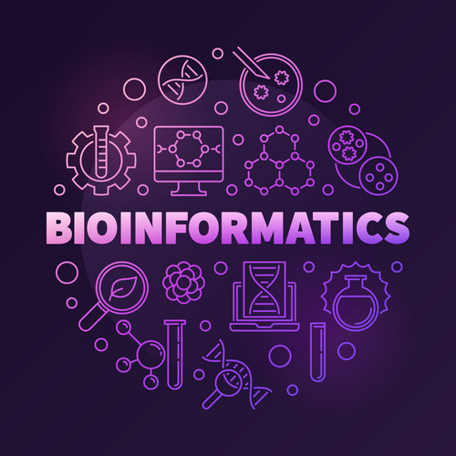
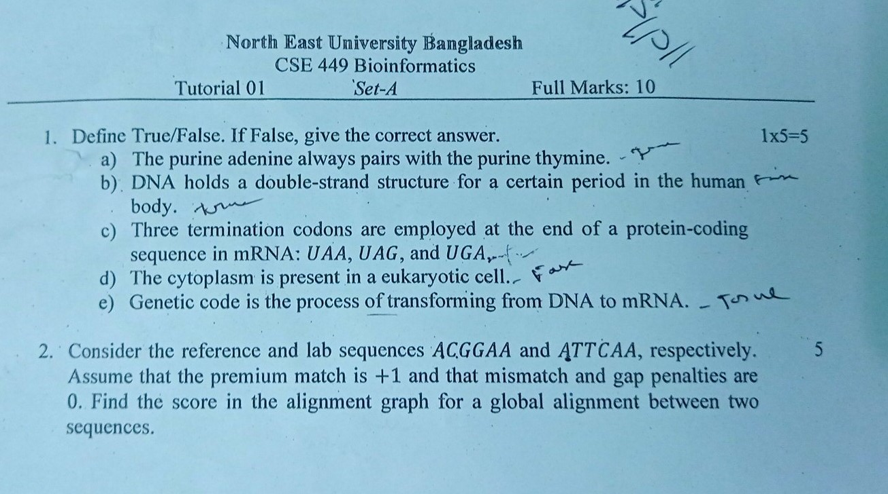
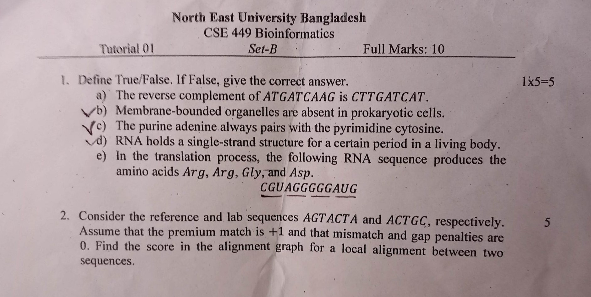

<a name="readme-top"></a>

[![Contributors][contributors-shield]][contributors-url]
[![Forks][forks-shield]][forks-url]
[![Stargazers][stars-shield]][stars-url]
[![Issues][issues-shield]][issues-url]
[![MIT License][license-shield]][license-url]
[![LinkedIn][linkedin-shield]][linkedin-url]


<!-- PROJECT LOGO -->
<br />
<div align="center">
  <a href="https://github.com/mamutalib/Bio-informatics">
    
  </a>

  <h3 align="center">Bio-informatics</h3>

  <p align="center">
    Bio-informatics for NEUB students
    <br />
    <a href="https://github.com/mamutalib/Bio-informatics"><strong>Explore the docs »</strong></a>
    <br />
    <br />
    <a href="https://mamutalib.github.io/Bio-informatics">View Demo</a>
    ·
    <a href="https://github.com/mamutalib/Bio-informatics/issues">Report Bug</a>
    ·
    <a href="https://github.com/mamutalib/Bio-informatics/issues">Request Feature</a>
  </p>
</div>


<!-- TABLE OF CONTENTS -->
<details>
  <summary>Table of Contents</summary>
  <ol>
    <li>
      <a href="#about-the-project">About The Project</a>
      <ul>
        <li><a href="#built-with">Built With</a></li>
      </ul>
    </li>
    <li>
      <a href="#getting-started">Getting Started</a>
      <ul>
        <li><a href="#prerequisites">Prerequisites</a></li>
        <li><a href="#installation">Installation</a></li>
      </ul>
    </li>
    <li><a href="#usage">Usage</a></li>
    <li><a href="#roadmap">Roadmap</a></li>
    <li><a href="#contributing">Contributing</a></li>
    <li><a href="#license">License</a></li>
    <li><a href="#contact">Contact</a></li>
    <li><a href="#acknowledgments">Acknowledgments</a></li>
  </ol>
</details>


<!-- ABOUT THE PROJECT -->
## About The Project

[![Product Name Screen Shot][product-screenshot]](https://example.com)

## Tutorial Question
#### Set-A
> 
Question 1 ans: 

    a)False
    b)True
    c)True
    d)True
    e)false

 <br>

#### Set-B
> 
Question 1 ans

    a)True
    b)true
    c)false
    d)True
    e)false

## Bio Informatics Lab
- [DNA Counting](https://mamutalib.github.io/neub/Dual%20semester%204-1/Bio-informatics/Lecture/#dna-counting)
- [DNA Complementary](https://mamutalib.github.io/neub/Dual%20semester%204-1/Bio-informatics/Lecture/#dna-complementary)
- [RNA Complementary](https://mamutalib.github.io/neub/Dual%20semester%204-1/Bio-informatics/Lecture/#rna-complementary)
- [DNA Reversal](https://mamutalib.github.io/neub/Dual%20semester%204-1/Bio-informatics/Lecture/#dna-reversal)
- [DNA Transcription](https://mamutalib.github.io/neub/Dual%20semester%204-1/Bio-informatics/Lecture/#dna-transcription)
- [Smith Waterman Algorithm](https://mamutalib.github.io/neub/Dual%20semester%204-1/Bio-informatics/Lecture/#dna-transcription)
- [Needleman Algorithm](https://mamutalib.github.io/neub/Dual%20semester%204-1/Bio-informatics/Lecture/#needleman-algorithm)
- [Edit Distance](https://mamutalib.github.io/neub/9thSemester-Dual/Bio-informatics/Lecture/#edit-distance)

### DNA Counting
```py
#include <bits/stdc++.h>
using namespace std;

int main(void) {
    string str;
    cin >> str;

    int len = str.size();
    int a = 0, c = 0, g = 0, t = 0;
    for(int i = 0; i<len; i++) {
        if(str[i] == 'A') a++;
        else if (str[i] == 'C') c++;
        else if (str[i] == 'G') g++;
        else if (str[i] == 'T') t++;
    }
    cout << "A: " << a << " C: " << c << " G: " << g << " T: " << t << endl;
    return 0;
}
// Sample input: ACGTATTC
//        Ouput: A: 2 C: 2 G: 1 T: 3
```

<p align="right">(<a href="#readme-top">back to top</a>)</p>

### DNA complementary
```java
#include <bits/stdc++.h>
using namespace std;

void dnaComplementary(string str) {
    int len = str.length();
    for (int i = 0; i<len; i++) {
        if(str[i] == 'A'){
            str[i] = 'T';
        }
        else if(str[i] == 'T'){
            str[i] = 'A';
        }
        else if(str[i] == 'C'){
            str[i] = 'G';
        }
        else if(str[i] == 'G'){
            str[i] = 'C';
        }
    }
    for(int i =0; i<len; i++) {
        cout << str[i];
    }
}

int main() {
    string str;
    cin >> str;
    dnaComplementary(str);

}


/*
Sample input-output:
ACGTATTC
TGCATAAG
*/
```
<p align="right">(<a href="#readme-top">back to top</a>)</p>

### RNA Complementary 
```c++
#include <bits/stdc++.h>
using namespace std;

void rnaComplementary(string str) {
    int len = str.length();
    for (int i = 0; i<len; i++) {
        if(str[i] == 'A'){
            str[i] = 'U';
        }
        else if(str[i] == 'U'){
            str[i] = 'A';
        }
        else if(str[i] == 'C'){
            str[i] = 'G';
        }
        else if(str[i] == 'G'){
            str[i] = 'C';
        }
    }
    for(int i =0; i<len; i++) {
        cout << str[i];
    }
}

int main() {
    string str;
    cin >> str;
    rnaComplementary(str);

}

/*
Sample input:AACGUAGGCUC
    output  :UUGCAUCCGAG
*/
```
<p align="right">(<a href="#readme-top">back to top</a>)</p>

### DNA Reversal 

```php
#include <bits/stdc++.h>
using namespace std;

void dnaReversal(string str) {
    int len = str.length();
    for (int i = len; i>=0; i--){
        if(str[i] == 'A'){
            str[i] = 'T';
        }
        else if(str[i] == 'T'){
            str[i] = 'A';
        }
        else if(str[i] == 'C'){
            str[i] = 'G';
        }
        else if(str[i] == 'G'){
            str[i] = 'C';
        }
    }
    for(int i = len; i>=0; i--) {
        cout << str[i];
    }
}

int main() {
    string str;
    cin >> str;
    dnaReversal(str);

}
/*

Sample input  : AACGTAGGCTC
        output: GAGCCTACGTT
*/

```
<p align="right">(<a href="#readme-top">back to top</a>)</p>

### DNA Transcription
```c
#include <bits/stdc++.h>
using namespace std;

void transcriptDNA(string str) {
    int len = str.length();
    for (int i = 0; i<len; i++) {
                if(str[i] == 'T'){
            str[i] = 'U';
        }
    }
    for(int i =0; i<len; i++) {
        cout << str[i];
    }
}

int main() {
    string str;
    cin >> str;
    transcriptDNA(str);

}
/*

Sample input: AACGTAGGCTC
    output  : AACGUAGGCUC
*/
```
<p align="right">(<a href="#readme-top">back to top</a>)</p>

### Smith WaterMan Algorithm
```py
#include <bits/stdc++.h>
using namespace std;

int main() {
    string ls="AGCT", rs="ATGCT";
    //cin >> ls >> rs;

    int row, col;
    row = ls.length()+1;
    col = rs.length()+1;

    int data[row][col];

    for (int i = 0; i<row; i++) {
        for (int j = 0; j<col; j++) {
            data[i][j] = 0;
        }
    }
    int match = 1 ,misMatch = -1,gap = -2;
    int lef_adj = 0, up_adj = 0, dia_adj = 0;

    for (int i = 1; i<row; i++) {
        for (int j = 1; j<col; j++) {
            lef_adj = data[i-1][j] + gap;
            if(lef_adj < 0) {
                lef_adj =0;
            }

            up_adj = data[i][j-1] + gap;
            if (up_adj < 0) {
                up_adj = 0;
            }

            if(ls[i-1] == rs[j-1]) {
                dia_adj = data[i-1][j-1]+match;
            }
            else {
                dia_adj = data[i-1][j-1]+misMatch;
            }

            data[i][j] = max(lef_adj, up_adj);
            data[i][j] = max(data[i][j], dia_adj);
        }
    }

     for (int i = 0; i<row; i++) {
        for (int j = 0; j<col; j++) {
            cout << data[i][j] << " ";
        }

        cout << "\n";
    }
    return 0;
}

```
<p align="right">(<a href="#readme-top">back to top</a>)</p>

## Needleman Algorithm

```c++
#include <bits/stdc++.h>
using namespace std;

int main() {
    string ls="AGCT", rs="ATGCT";

    int row, col;
    row = ls.length()+1;
    col = rs.length()+1;

    int data[row][col];

    for (int i = 0; i<row; i++) {
        for (int j = 0; j<col; j++) {
            data[i][j] = 0;
        }
    }

    for (int i = 0; i<1; i++) {
        for (int j = 1; j<col; j++) {
            data[i][j] = -j*2;
        }
    }
    for (int i = 0; i<row; i++) {
        for (int j = 0; j<1; j++) {
            data[i][j] = -i*2;
        }
    }


     for (int i = 0; i<row; i++) {
        for (int j = 0; j<col; j++) {
            cout << data[i][j] << " " ;
        }
        cout << endl;
    }


    int match = 1 ,misMatch = -1,gap = -2, lef_adj = 0, up_adj = 0, dia_adj = 0;

    for (int i = 1; i<row; i++) {
        for (int j = 1; j<col; j++) {

            lef_adj = data[i-1][j] + gap;

            up_adj = data[i][j-1] + gap;

            if(ls[i-1] == rs[j-1]) {
                 dia_adj = data[i-1][j-1]+match;
            }
            else {
                dia_adj = data[i-1][j-1]+misMatch;
            }

            data[i][j] = max(lef_adj, up_adj);
            data[i][j] = max(data[i][j], dia_adj);
        }
    }


    cout << endl;

     for (int i = 0; i<row; i++) {
        for (int j = 0; j<col; j++) {
            cout << data[i][j] << " ";
        }

        cout << "\n";
    }


    return 0;
}

```
<p align="right">(<a href="#readme-top">back to top</a>)</p>

## Edit Distance
```c
#include <bits/stdc++.h>
using namespace std;

int main(void) {

    string str1,str2;
    int row,col;

    cin >> str1>> str2;

    row = str1.length()+1;
    col = str2.length()+1;
    int data[row][col];

    for(int i=0; i<row; i++){
        data[i][0] = i;
    }

    for( int j=0; j<col; j++){
        data[0][j] = j;
    }

    int up_adj, lft_adj, dig_adj;

    for( int i=1; i<row; i++)
    {
        for(int j=1; j<col; j++)
        {
            lft_adj = data[i-1][j] ;
            up_adj = data[i][j-1];
            dig_adj = data[i-1][j-1];

            if(str1[i-1] == str2[j-1])
            {
                data[i][j]= dig_adj;
            }
            else
            {
                data[i][j] = min(lft_adj+1 ,up_adj+1 );
                data[i][j] = min(data[i][j], dig_adj+1 );
            }
        }
    }

    for(int i = 0; i<row; i++) {
        for(int j = 0; j<col; j++) {
            cout << data[i][j] << " ";
        }
        cout << endl;
    }
    return 0;
}
```

<p align="right">(<a href="#readme-top">back to top</a>)</p>


<!-- GETTING STARTED -->
## Getting Started

This is an example of how you may give instructions on setting up your project locally.
To get a local copy up and running follow these simple example steps.

### Installation

_Below is an example of how you can instruct your audience on installing and setting up your app. This template doesn't rely on any external dependencies or services._

1. Clone the repo
   ```sh
   git clone https://github.com/mamutalib/Bio-informatics.git
   ```

<p align="right">(<a href="#readme-top">back to top</a>)</p>


<!-- CONTRIBUTING -->
## Contributing

Contributions are what make the open source community such an amazing place to learn, inspire, and create. Any contributions you make are **greatly appreciated**.

If you have a suggestion that would make this better, please fork the repo and create a pull request. You can also simply open an issue with the tag "enhancement".
Don't forget to give the project a star! Thanks again!

1. Fork the Project
2. Create your Feature Branch (`git checkout -b feature/AmazingFeature`)
3. Commit your Changes (`git commit -m 'Add some AmazingFeature'`)
4. Push to the Branch (`git push origin feature/AmazingFeature`)
5. Open a Pull Request

<p align="right">(<a href="#readme-top">back to top</a>)</p>


<!-- LICENSE -->
## License

Distributed under the MIT License. See `LICENSE.txt` for more information.

<p align="right">(<a href="#readme-top">back to top</a>)</p>


<!-- CONTACT -->
## Contact

Md. Abdul Mutalib - [Twitter](https://twitter.com/mamutalibcse) - mutalibcse@yahoo.com

Project Link: [https://github.com/mamutalib/Bio-informatics](https://github.com/mamutalib/Bio-informatics)

<p align="right">(<a href="#readme-top">back to top</a>)</p>


<!-- ACKNOWLEDGMENTS -->
## Acknowledgments

Use this space to list resources you find helpful and would like to give credit to. I've included a few of my favorites to kick things off!

* [Choose an Open Source License](https://choosealicense.com)
* [GitHub Emoji Cheat Sheet](https://www.webpagefx.com/tools/emoji-cheat-sheet)
* [Malven's Flexbox Cheatsheet](https://flexbox.malven.co/)
* [Malven's Grid Cheatsheet](https://grid.malven.co/)
* [Img Shields](https://shields.io)
* [GitHub Pages](https://pages.github.com)
* [Font Awesome](https://fontawesome.com)
* [React Icons](https://react-icons.github.io/react-icons/search)

<p align="right">(<a href="#readme-top">back to top</a>)</p>


<!-- MARKDOWN LINKS & IMAGES -->
<!-- https://www.markdownguide.org/basic-syntax/#reference-style-links -->
[contributors-shield]: https://img.shields.io/github/contributors/mamutalib/Bio-informatics.svg?style=for-the-badge
[contributors-url]: https://github.com/mamutalib/Bio-informatics/graphs/contributors
[forks-shield]: https://img.shields.io/github/forks/mamutalib/Bio-informatics.svg?style=for-the-badge
[forks-url]: https://github.com/mamutalib/Bio-informatics/network/members
[stars-shield]: https://img.shields.io/github/stars/mamutalib/Bio-informatics.svg?style=for-the-badge
[stars-url]: https://github.com/mamutalib/Bio-informatics/stargazers
[issues-shield]: https://img.shields.io/github/issues/mamutalib/Bio-informatics.svg?style=for-the-badge
[issues-url]: https://github.com/mamutalib/Bio-informatics/issues
[license-shield]: https://img.shields.io/github/license/mamutalib/Bio-informatics.svg?style=for-the-badge
[license-url]: https://github.com/mamutalib/Bio-informatics/blob/master/LICENSE.txt
[linkedin-shield]: https://img.shields.io/badge/-LinkedIn-black.svg?style=for-the-badge&logo=linkedin&colorB=555
[linkedin-url]: https://linkedin.com/in/Md-Abdul-Mutalib
[product-screenshot]: images/screenshot.png
[Next.js]: https://img.shields.io/badge/next.js-000000?style=for-the-badge&logo=nextdotjs&logoColor=white
[Next-url]: https://nextjs.org/
[React.js]: https://img.shields.io/badge/React-20232A?style=for-the-badge&logo=react&logoColor=61DAFB
[React-url]: https://reactjs.org/
[Vue.js]: https://img.shields.io/badge/Vue.js-35495E?style=for-the-badge&logo=vuedotjs&logoColor=4FC08D
[Vue-url]: https://vuejs.org/
[Angular.io]: https://img.shields.io/badge/Angular-DD0031?style=for-the-badge&logo=angular&logoColor=white
[Angular-url]: https://angular.io/
[Svelte.dev]: https://img.shields.io/badge/Svelte-4A4A55?style=for-the-badge&logo=svelte&logoColor=FF3E00
[Svelte-url]: https://svelte.dev/
[Laravel.com]: https://img.shields.io/badge/Laravel-FF2D20?style=for-the-badge&logo=laravel&logoColor=white
[Laravel-url]: https://laravel.com
[Bootstrap.com]: https://img.shields.io/badge/Bootstrap-563D7C?style=for-the-badge&logo=bootstrap&logoColor=white
[Bootstrap-url]: https://getbootstrap.com
[JQuery.com]: https://img.shields.io/badge/jQuery-0769AD?style=for-the-badge&logo=jquery&logoColor=white
[JQuery-url]: https://jquery.com 
